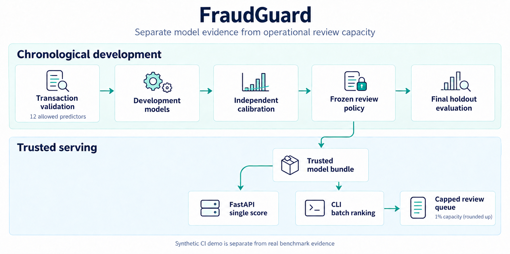

# FraudGuard

**Score transaction fraud risk and allocate a bounded human-review queue.**

[](https://github.com/luqshzeeq3601-art/04_FraudGuard_Transaction_Fraud_Detection/actions/workflows/ci.yml)
[](LICENSE)

FraudGuard uses 12 allowlisted transaction predictors, chronological development/calibration/policy/test partitions, independent calibration and a frozen review policy. FastAPI scores single transactions; the CLI ranks batches and applies an integer review budget. This is a benchmark demonstrator, not a payment-blocking service.

## 1. Workflow



The batch capacity is `ceil(0.01 * batch_size)`; small batches therefore round up. The policy cutoff and deterministic ranking can select fewer rows. A single API request cannot enforce a global batch-review budget. Synthetic CI models are kept distinct from real IEEE-CIS benchmark evidence.

## 2. Measured results

Final chronological holdout: **118,108 transactions**, 4,064 fraud cases, 3.44% prevalence. The selected model is calibrated LightGBM.

| Measure | Champion | Logistic-regression reference |
| --- | --- | --- |
| Average precision (AP) | **0.1809** | 0.1487 |
| AP 95% block-bootstrap interval | **[0.1642, 0.1996]** | [0.1332, 0.1654] |
| ROC-AUC | **0.8028** | 0.7760 |
| Precision@1% | **0.3443** | 0.3071 |
| Recall@1% | **0.1001** | 0.0893 |

Source: [final evaluation](reports/final/final_evaluation.json), [model card](docs/MODEL_CARD.md). AP is sensitive to prevalence. The detailed cost model uses assumed cost units; it does not measure recovered money or real fraud prevention.

## 3. Quick start

Use Python 3.10. Clone/download the same branch or revision as this README, then run from the repository root. The verified updates are currently in [draft PR 1](https://github.com/luqshzeeq3601-art/04_FraudGuard_Transaction_Fraud_Detection/pull/1) on `fix/portfolio-remediation`.

```sh
python -m venv .venv
```

Activate with `.\.venv\Scripts\Activate.ps1` in Windows PowerShell, or `source .venv/bin/activate` on Linux/macOS.

```sh
python -m pip install -r requirements-lock.txt
python -m pip install --no-deps -e .
```

### Try validation with synthetic data

This path requires neither Kaggle credentials nor the restricted raw benchmark file and leaves the saved real evaluation reports intact.

```sh
python -m fraudguard.cli generate-synthetic --rows 5000 --days 5 --fraud-rate 0.035 --output data/raw/demo_synthetic.csv
python -m fraudguard.cli validate --input data/raw/demo_synthetic.csv --report reports/demo_quality.json
python -m fraudguard.cli --help
```

For a complete synthetic training/calibration/freeze/serving demonstration, use the exact [CI fixture pipeline](.github/workflows/ci.yml). For real-data reproduction, obtain IEEE-CIS through its official access process and follow [the operations guide](docs/07_OPERATIONS_AND_COMMANDS.md) and [data specification](docs/03_DATA_SPEC.md).

### Serve an approved trusted bundle

The real champion artifacts and raw IEEE-CIS data are **not included in public source**. Create or obtain an approved trusted bundle first; the API must fail readiness if it is missing or invalid. Never load an uploaded/untrusted pickle or joblib model.

```sh
python -m uvicorn fraudguard.api:app --host 127.0.0.1 --port 8000
```

Open [local API docs](http://127.0.0.1:8000/docs). [Synthetic transaction](examples/synthetic_transaction.json) · [Synthetic batch](examples/synthetic_batch.csv).

### Docker with a read-only model mount

The non-root image contains code/dependencies. In Bash, from a repository with an approved `artifacts/champion` bundle:

```sh
docker build -t fraudguard:local .
docker run --rm -p 127.0.0.1:8000:8000 --mount "type=bind,source=$(pwd)/artifacts/champion,target=/app/artifacts/champion,readonly" fraudguard:local
```

On PowerShell, use `(Resolve-Path artifacts/champion).Path` as the absolute bind-mount source. Keep the mounted files readable by the container user and identify whether the bundle is real or synthetic.

## 4. API and verification

| Endpoint | Purpose |
| --- | --- |
| `GET /health` | Liveness |
| `GET /ready` | Trusted champion loaded |
| `GET /model-info` | Bundle, calibration and policy metadata |
| `POST /v1/score` | Single transaction risk and routing information |

**Full-test prerequisite:** a fresh public checkout has no champion or processed split manifest. In a disposable fresh checkout, create the same synthetic fixture used by CI before running pytest. These training steps write their standard artifact/report paths; keep them separate from a checkout holding the real benchmark release.

```sh
python -m fraudguard.cli generate-synthetic --rows 5000 --days 5 --fraud-rate 0.035 --output data/raw/train_transaction.csv
python -m fraudguard.cli split --input data/raw/train_transaction.csv --output-dir data/processed
python -m fraudguard.cli train --models prior amount logistic --output-dir artifacts/baselines
python -m fraudguard.cli tune --output-dir artifacts/selection --comparison-report reports/development_model_comparison.csv
python -m fraudguard.cli calibrate --output-dir artifacts/champion
python -m fraudguard.cli freeze-policy --output reports/freeze_manifest.json
```

Then run the tests and lint checks:

```sh
python -m pytest -p no:cacheprovider --basetemp .pytest_tmp
python -m ruff check src tests
python -m ruff format --check src tests
```

CI uses this synthetic fixture, the >=80% coverage gate, a code-only image build and readiness/scoring through a read-only synthetic bundle mount. The synthetic bundle can also be used for the local serving examples; identify it as synthetic.

## 5. Limitations and delivery

- Later transactions differ from development data; the benchmark does not establish performance on live payments or other fraud labels.
- Identity joins and opaque C/D/V fields are outside the declared feature scope. Recall@1% remains limited by the review budget.
- **Public hosted scoring remains unverified** and requires an approved artifact-delivery method. The Render blueprint is not proof of a live service.
- Human review, payment actions, streaming and automatic retraining are outside this MVP.

## 6. Documentation and contributions

[Start here](docs/00_START_HERE.md) · [Technical design](docs/04_TECHNICAL_DESIGN.md) · [Tasks](tasks/todo.md) · [Progress](docs/09_PROGRESS_LOG.md) · [Sources](docs/10_SOURCES.md) · [Release checklist](reports/release_checklist.md) · [Diagram notes and prompt](docs/assets/workflow.md)

Follow [AGENTS.md](AGENTS.md). Keep partition timing and the frozen policy intact; do not tune using final-test labels or publish restricted raw data/model artifacts.

## 7. License and data

The [MIT license](LICENSE) covers project code/documentation. IEEE-CIS/Kaggle benchmark access and redistribution have separate terms; the repository includes aggregate evidence and synthetic examples rather than the restricted raw dataset.
