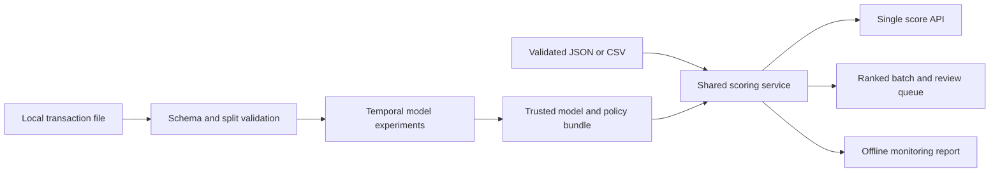

# 04. Technical design

## 1. Architecture



Batch and API call the same normalization, feature and prediction functions. Experiments fit their own preprocessing within permitted folds. There is no database or streaming service in MVP.

## 2. Technology decisions

| Layer | Default | Why |
|---|---|---|
| Runtime | Python 3.11, or a verified compatible available version | Matches the existing portfolio style; CPU ecosystem |
| Environment | Project-local venv + pip; exact lock file | Isolated and reproducible on Windows |
| Data | pandas, NumPy | Selected-column ingestion and reporting |
| Baselines | scikit-learn | Sparse preprocessing, LR and metrics |
| Challenger | LightGBM | Bounded CPU boosting experiment |
| Calibration | scikit-learn compatible sigmoid mapping | Check probabilities after class weighting |
| API | FastAPI, Pydantic, Uvicorn | Strict request and response contracts |
| Tracking | MLflow, local store | Comparable runs, parameters and artifacts |
| Explanation | SHAP offline; permutation importance | Local contributions and global diagnostics |
| Tests | pytest, pytest-cov, httpx | Core behaviour and API integration |
| Quality | Ruff | Lint and formatting |
| Delivery | Docker and GitHub Actions | Local packaging and synthetic CI |
| Configuration | JSON using Python standard library | Simple config, no extra YAML dependency |

**Versions are not pinned yet.** T01 checks official documentation, installs a compatible set in the local environment and records exact versions. Do not copy version claims from older projects without verification. No Optuna, Evidently or UI dependency is required for MVP.

## 3. Planned project structure

```text
AGENTS.md, README.md
docs/                       # contracts and handoff logs, present now
tasks/                      # authoritative plan and checklist, present now
pyproject.toml              # package, dev extras, lint/test config
requirements-lock.txt       # exact dependency lock
configs/project.json        # seed, model search, policy and resource defaults
src/fraudguard/
  cli.py                    # subcommands in the operations contract
  data.py, splits.py        # schemas, normalization and manifests
  features.py               # fitted preprocessing and row-local features
  metrics.py, policy.py     # ranking, simulated costs and selection rules
  train.py, calibration.py  # bounded temporal experiments
  artifacts.py, scoring.py  # trusted bundle and shared predictions
  api.py                    # HTTP wrapper, no duplicated ML logic
  explain.py, monitoring.py # offline reports
tests/                      # synthetic unit and integration tests
tests/fixtures/             # original synthetic examples
data/, artifacts/, reports/ # local generated outputs, ignored where required
Dockerfile, .dockerignore, .gitignore
.github/workflows/ci.yml
```

Only the Markdown files exist at planning handoff. Create the remaining files as their tasks become ready.

## 4. Code and configuration conventions

- Small pure functions for normalization, ranking and costs; injected artifact/config paths.
- Dataclasses or typed dictionaries for internal results; Pydantic models at HTTP boundaries.
- `snake_case` functions, `PascalCase` types and explicit exceptions with actionable messages.
- Config schema rejects unknown keys and invalid fractions, paths or resource settings.
- Never recompute medians/category vocabularies from serving batches.

Example intended style, not an implemented function:

```python
def review_capacity(row_count: int, fraction: float) -> int:
    if row_count < 1 or not 0 < fraction <= 1:
        raise ValueError("Expected a nonempty batch and a fraction in (0, 1].")
    return math.ceil(row_count * fraction)
```

## 5. API contract

| Route | Behaviour |
|---|---|
| `GET /health` | HTTP 200 if the process is alive; does not imply model readiness |
| `GET /ready` | HTTP 200 only after trusted compatible artifacts load; otherwise 503 |
| `GET /model-info` | Actual model/schema/policy versions, feature list, calibration status and training provenance; 503 if not ready |
| `POST /v1/score` | Strict JSON transaction envelope; score and recommendation |

Synthetic request example:

```json
{
  "TransactionID": 10001,
  "TransactionDT": 100000,
  "TransactionAmt": 120.5,
  "ProductCD": "W",
  "dist1": null,
  "dist2": null,
  "card4": "visa",
  "card6": "debit",
  "addr1": 100,
  "addr2": 87,
  "P_emaildomain": "example.com",
  "R_emaildomain": null,
  "M4": "M0",
  "M6": "T"
}
```

Illustrative response, **not a trained prediction**:

```json
{
  "TransactionID": 10001,
  "fraud_score": 0.72,
  "score_type": "calibrated_probability",
  "review_recommended": true,
  "model_version": "fraudguard-demo-v1",
  "schema_version": "transaction-v1",
  "policy_version": "review-v1"
}
```

- `fraud_score` is finite in [0, 1]. `score_type` is `raw_probability` or `calibrated_probability` according to the loaded bundle.
- `review_recommended = fraud_score >= frozen_threshold`. It is a review suggestion, not a fraud label or blocking action.
- Explainability is offline and excluded from the single-score response and latency target.
- Enforce 64 KiB request size, including streamed/chunked bodies. Fail invalid input with 422, oversized input with 413 and unavailable model with 503.
- Bind to `127.0.0.1` by default. No production authentication system or public exposure is part of MVP.

## 6. Batch contract

CLI consumes a scoring CSV with the fields in the data spec, no target and no extra columns. Validate the entire batch first. Reject empty files, duplicates, excess limits and malformed rows rather than returning partial success.

Output `scored.csv` includes all input identifiers and:

- `fraud_score`, `score_type`, `review_recommended`.
- `rank` in score-descending/ID-ascending order, starting at 1.
- `selected_for_review` according to cutoff and K cap.
- `model_version`, `schema_version`, `policy_version`.

Output `review_queue.csv` contains only selected rows and necessary model outputs. Do not copy the entire input payload into the queue by default. Scores are local data-derived artifacts, excluded from public publication.

## 7. Artifact contract

`artifacts/champion/` contains:

| File | Content |
|---|---|
| `pipeline.joblib` | Trusted fitted feature transformation and classifier |
| `calibration.joblib` | Optional fitted mapping; absence represented explicitly in manifest |
| `feature_schema.json` | Raw fields, types, null rules and fitted output feature mapping |
| `policy.json` | Threshold, default review fraction, tie rule and version |
| `reference_summary.json` | Development-only monitoring distributions; no raw rows |
| `manifest.json` | Hashes, library versions, config hash, data/split hashes, seed, calibration decision and run IDs |

At T07 a **provisional** baseline bundle may exist. It must be marked provisional; its cutoff is 0.5 solely for the first service slice. T12 replaces it with the frozen evaluated policy. Final reports cannot use the provisional policy as if it were selected.

Load a configured local trusted directory only. Fail readiness on missing, corrupted or incompatible bundles. Hash verification detects accidental alteration; it does not make an untrusted bundle safe.

## 8. Tracking and observability

- Record model, parameters, fold IDs, AP, ranking metrics, runtime and peak memory in local MLflow.
- Use structured request metadata: request ID, route, status, latency, artifact version and validation error category. Do not log transaction content or scores.
- Monitoring reads a frozen reference and a new batch. It reports input/score shifts; without labels it cannot report new fraud recall.
- Use synthetic drift perturbations to test monitoring logic; label them synthetic in reports.

### Monitoring rules to implement at T16

- Reference: development-only distributions and category vocabularies, generated with the final scoring bundle. Changing the bundle requires an explicitly versioned reference.
- Report row count, schema validity, missing rates, unseen-category rates, numeric/score quantiles and population stability index (PSI).
- Flag a field when its missing-rate change is >= 0.05 absolute, or its unseen-category rate is >= 0.05. These are heuristic demo thresholds.
- Numeric and score PSI uses up to 10 development quantile bins, duplicate edges removed, with open outer bounds. Persist open bounds as JSON nulls with explicit lower/upper-bound meaning.
- For reference fraction p and batch fraction q in each bin, add 1e-6 to fractions, renormalize, then sum `(q - p) * log(q / p)`. Flag PSI >= 0.2 as a heuristic distribution-change warning.
- If the reference is constant, report constant-reference status and the fraction of nonmissing new values that differ; flag a change fraction >= 0.05 instead of inventing PSI bins.
- Batches with fewer than 100 rows retain counts/schema diagnostics, but distribution warnings are marked insufficient support. Entirely missing numeric fields have missingness diagnostics and unavailable PSI.
- JSON and HTML reports share the same computed diagnostics. Warning status never triggers automatic retraining or claims degraded fraud recall.
