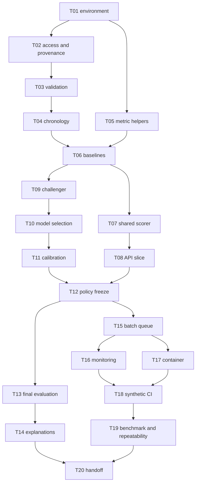

# FraudGuard implementation plan

## 1. Outcome and approach

Create a local fraud-review demonstrator with defensible temporal evaluation and a working scoring service. Use short, verifiable tasks. First complete a baseline-to-API vertical slice, then improve the model, freeze the review policy and finish delivery.

Scope authority: [PRD](../docs/02_PRD.md). Task status authority: [todo.md](todo.md).

## 2. Planning assumptions

- Solo owner, CPU development, approximately 10 focused hours/week.
- Estimate: **60-80 focused hours**, typically **6-8 weeks**, plus one contingency week.
- Week numbers are relative to an eventual start instruction; no fixed start date or deadline is assumed.
- Dataset access, hardware and dependency versions must be verified first.
- No implementation work was started when this plan was written on 6 October 2026.

## 3. Architecture decisions

1. Compact allowlisted features keep data ingestion and service inputs understandable.
2. Separate chronology for model selection, calibration, policy and final test prevents future evaluation information entering training.
3. Shared scoring logic prevents CLI/API differences.
4. Capacity cap and deterministic ties make analyst workload explicit.
5. Local delivery and synthetic CI make progress independent of public cloud access.
6. Keep experiments bounded; adopt a simpler model when the evidence supports it.

## 4. Dependency order

Execute dependency-ready tasks in checklist order by default. T05 and synthetic package work can proceed while T02 is externally blocked. No full-data model task may skip the data-integrity gate.

## 5. Milestones and indicative schedule

| Milestone | Relative weeks | Tasks | Exit condition |
|---|---|---|---|
| G1 data integrity | W1-W2 | T01-T04 | Provenance, schema and timestamp-disjoint manifest pass |
| G2 first scoring slice | W2-W3 | T05-T08 | Baseline -> trusted bundle -> API works with synthetic parity checks |
| G3 candidate/policy freeze | W3-W4 | T09-T12 | Bounded CV, calibration evidence and frozen bundle/policy hashes |
| G4 final science | W4-W5 | T13-T14 | Final metrics, uncertainty, explanations and explicit target outcomes |
| G5 local delivery | W5-W6 | T15-T18 | Ranked CLI, monitoring, running local container and synthetic CI |
| G6 reproducible handoff | W6-W8 | T19-T20 | Benchmark, repeatability and completed docs/model card |

Week ranges overlap because actual task duration and availability are uncertain. Checkpoint evidence, not the calendar, determines progression.

## 6. Task sizing and control

- Each task covers one bounded behaviour with up to five primary implementation/test files.
- Common progress/decision log updates do not expand the task's implementation scope.
- If a task requires more than five primary files or more than one focused session, split it before execution and retain dependency/requirement traceability.
- Record actual hours after a task; update remaining estimates without rewriting past evidence.
- Review contracts and evidence at each gate. Routine work inside scope continues without repeated approval.

## 7. Risk management

Highest-priority risks are access/terms, chronology, compact-feature quality and hardware. Address them before tuning or UI work. The full [risk register](../docs/11_RISKS_AND_BACKLOG.md) specifies mitigations and stop conditions.

If a more complex model does not improve the declared ranking rule, keep LR. If final usefulness fails, report the shortfall. Neither outcome justifies expanding into a new dataset or feature set without a recorded scope decision.

## 8. Acceptance and handoff

1. Pass [validation gates](../docs/06_VALIDATION_AND_RELEASE.md).
2. Trace every PRD Must requirement to verified tasks and evidence.
3. Update actual commands, results, model card and logs.
4. Leave a concrete next task or explicitly state local MVP complete, including any model-quality shortfall.
5. Treat public release and real payment integration as later authorized work.

## 9. Open execution facts

- Available interpreter, memory, Docker and Git state: inspect at T01.
- Kaggle consent/access and exact applicable terms: resolve at T02.
- Actual field ranges, prevalence and class counts: profile at T03-T04 under the holdout restrictions.
- Compatible library APIs and measured runtimes: verify during the relevant tasks.

These facts do not prevent the planning handoff. They do prevent claiming execution results today.
